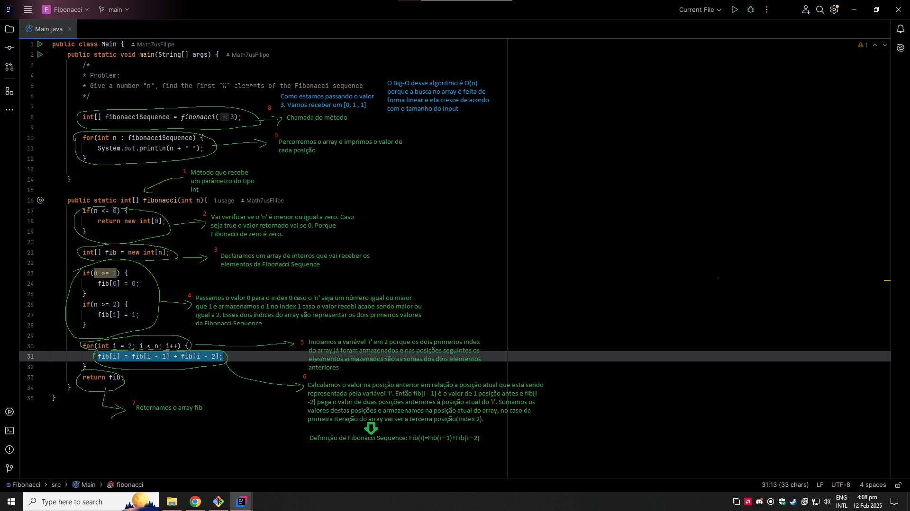

### Fibonacci Sequence
**Problema:**
Dado um número 'n', o algoritmo deve encontrar os 'n' elementos da sequência de Fibonacci.
 
**Fibonacci Sequence:***
A sequência de Fibonacci é uma série numérica em que cada número é a soma dos dois anteriores, começando com 0 e 1.
 
**Exemplo:**
 
Fibonacci(2) = [0, 1]
 
Fibonacci(3) = [0, 1, 1]
 
Fibonacci(4) = [0, 1, 1, 2]
 
**Resolução:**
